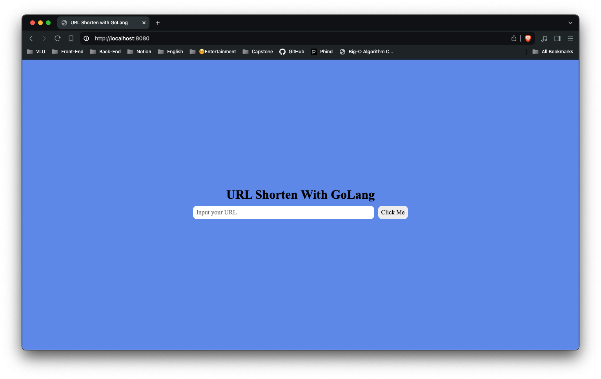

# URL Shorten with GoLang

**Author** : [Bill Zay](https://github.com/billzayy)

A simple project for practice GoLang knowledge

---

**Run this command to run project** : 
```bash
docker compose -f ./db/docker-compose.yml up -d
```

After run the command, you can access to `localhost:8080` and try it !!!



<br>


$${\color{lightgreen}HAPPY \space CODING \space 😉 \space !!!}$$	
